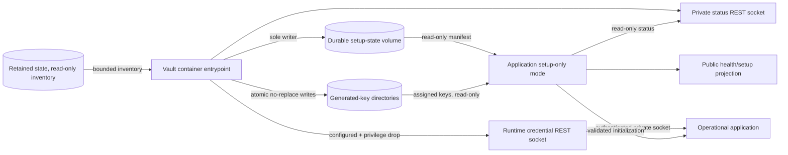

# SecretSauce v2.1 Vault-Owned Provisioning

- **Status:** Approved architecture baseline for milestone planning
- **Governing contract:** `docs/prd/secretsauce-v2.1-prd.md`
- **Supersedes for v2.1:** manual application/vault key provisioning in the v2
  example deployment

## Scope

This record selects the v2.1 coordinator, fixed key registry, manifest ownership,
deployment topology, private provisioning-status interface, explicit
envelope-root maintenance transition, privilege transition, and failure
behavior. It does not implement the design or change the runtime vault's
credential capabilities.

## Executive Summary

The existing `secretsauce-vault` deployed service owns provisioning through a
startup entrypoint and then transitions into the runtime credential service. No
third setup service and no initialization CLI are introduced.

The vault entrypoint is the sole writer of a dedicated durable setup-state
volume and the sole generator of SecretSauce-owned application keys. The
release registry is a stable superset independent of enabled features.
Configured identity/vault envelope-root rotation reuses the same entrypoint only
when the container starts with an exact host-local target argument and fresh
canonical request UUID; it is idempotent, journaled, exclusive, setup-only, and
absent from the REST API.
The application starts concurrently in setup-only mode and reads a bounded private
HTTP/1.1 REST status resource over a separate Unix-domain socket. The
authenticated credential REST socket opens only after the manifest commits to
`configured` and the entrypoint drops setup-only privileges. The vault container
has no network attachment in any phase.

## Decision

### Ownership

- The vault provisioning entrypoint owns the installation identifier,
  progressive manifest, per-entry transitions, configured commitment, retry
  state, and sanitized private status.
- A closed registry of key-type adapters inside the vault entrypoint owns key
  format generation, canonical fingerprints, validation, and adoption checks.
- The registry contains the fixed, release-versioned superset of every
  SecretSauce-owned application key identity supported by v2.1. Feature
  configuration affects consumption, not generation or manifest membership.
- A closed registry of store-specific inventory adapters classifies recognized
  retained key-bound stores as absent/empty, present, or indeterminate.
- The same closed store adapters perform expected-old-version rewraps only
  during an explicitly requested, journaled identity/vault root transition.
- Runtime vault and application components never generate or replace application
  keys.

### Deployment topology



Compose starts the vault and application concurrently. The application does not
wait for operational vault readiness merely to expose liveness, readiness,
sanitized setup status, and safe static assets. It defers its database writer,
key-dependent subsystems, and ordinary web, control, OAuth, and MCP behavior
until vault provisioning reports `ready`. The vault service is configured
without a network namespace attachment; both of its interfaces use shared Unix
sockets and the versioned API in [vault-rest-api.md](vault-rest-api.md).

### Access and privilege boundaries

| Phase/identity | Setup state | Generated keys | Retained state | Status socket | Broker socket |
| --- | --- | --- | --- | --- | --- |
| Vault provisioning entrypoint | Read/write | Write only as allowed by the startup matrix | Read-only inventory | Serve bounded read-only status | Closed |
| Vault root-maintenance entrypoint | Read/write manifest, one durable operation journal, and completed-request receipts | Selected versioned root location only; old root retained through commit | Exclusive, bounded read/write access to the affected encrypted store through its closed adapter | Serve bounded read-only status | Closed |
| Vault status-only error identity | Read-only | No setup write access | No setup write access | Serve `configuration_error` | Closed |
| Runtime vault identity | Read-only fields needed by vault | Vault root, caller-verification keys, and capability-verification keys only | Vault store only | Serve `ready` | Open |
| Application setup-only identity | Read-only configured fields | Assigned keys mounted but not loaded before ready | No database writer | Query | No client use |
| Operational application identity | Read-only configured fields | Assigned keys, read-only | Normal least-privilege runtime access | Query | Authenticated client |

The implementation may use process credential changes, a narrow launcher, or an
equivalent irreversible OS boundary. It must prove that the runtime vault cannot
regain setup-only or root-maintenance access to key directories or affected
stores after the credential API opens.

Both private socket parents are vault-owned, non-symlinked, and not writable by
the application or another workload. The application receives the shared socket
volume read-only: it may connect to the permitted sockets but cannot bind,
unlink, rename, or replace them. First-party clients validate endpoint type,
owner, and mode before connection and fail closed on any unsafe change.

### Provisioning-status REST interface

The status surface is a dedicated HTTP/1.1 REST resource over a Unix-domain
socket, not a TCP or public endpoint and not a resource on the authenticated
credential API socket. Filesystem ownership and mode authorize the application
identity before caller HMAC keys exist.

The request has no body, query, path parameter, or other caller-controlled
field. The closed JSON response contains:

```text
state: preparing | ready | configuration_error
retry_pending: boolean
error_category: bounded sanitized enum | absent
```

The operation cannot start, retry, clear, adopt, or otherwise alter
provisioning. The application treats an absent socket, timeout, malformed
response, or unknown enum as `not_ready`. It maps private status to the PRD's
public setup contract; UX, OAuth, and MCP clients never connect to the vault
directly.

### Lifecycle

1. Both containers start; the application enters setup-only mode.
2. The vault entrypoint loads structural configuration and closed adapter
   registries.
3. It completes all manifest, key, retained-state, storage, and adoption
   preflight checks before a write.
4. If fresh provisioning is permitted, it creates the complete progressive
   manifest before the first key and advances entries durably.
5. Retryable fresh failures retain setup authority, expose `preparing` with
   retry pending, and use bounded backoff.
6. A fatal continuity or validation failure performs no prohibited key/manifest
   write, relinquishes setup authority, and remains in status-only
   `configuration_error` until operator correction and restart.
7. Configured completion commits the aggregate, drops setup-only privileges,
   starts the authenticated credential REST API, and reports `ready`.
8. The application validates its assigned keys and manifest entries, then
   initializes persistence, audit, credential-API handshake, jobs, and ordinary
   listeners.

### Explicit root-maintenance lifecycle

1. A host administrator restarts the vault with exactly
   `--rotate-root-key identity` or `--rotate-root-key vault` and a fresh
   canonical UUID in `--rotation-request-id`.
2. The application remains setup-only, the credential socket remains absent,
   and one vault entrypoint obtains exclusive maintenance authority.
3. Complete manifest, key, aggregate, selected-root, affected-store, and
   continuity validation precedes every write.
4. The entrypoint durably creates a single-operation journal bound to the
   request UUID, installation, target, starting aggregate, and old/new physical
   versions, atomically stages a new versioned root without replacing the old
   root, and activates it for new writes.
5. The closed store adapter resumably rewraps affected data-encryption keys with
   conditional mutations that apply only when the current root reference is the
   expected old version. The mechanism is not coupled to SQL.
6. After inventory proves zero old-root references, one atomic commit updates
   the manifest fingerprint, active version, aggregate, and completed-request
   receipt. Only then is the old root retired from application use. Reusing that
   request UUID is an idempotent no-change result, never a second rotation.
7. A restart with a valid incomplete journal resumes that transition before
   ordinary startup even if the command argument is no longer present. Invalid
   or ambiguous state fails closed in status-only `configuration_error`.
8. Successful completion removes maintenance authority, drops to the runtime
   identity, opens the credential API, and permits application initialization.

## Security Review

Good: provisioning has one writer and one generator, so there is no distributed
commit protocol or per-service key-generation race. The status REST resource is
read-only, local, input-free, bounded, and separate from the credential API.

Risky: the vault setup phase temporarily has authority over every generated
application key and can inspect whether retained stores contain state. A defect
or compromise in that phase has installation-wide impact.

Risky: explicit root maintenance temporarily gains exclusive write authority to
one affected encrypted store. A faulty rewrap or premature old-root retirement
could make retained data unavailable.

Change: minimize the setup entrypoint, use closed adapters, perform every
continuity check before writes, prohibit secret-bearing diagnostics, and make
the privilege drop an integration-tested boundary. Give retained-state adapters
read-only access and return only bounded classifications. Deployment tests must
prove the vault has no network attachment, not merely no published port.
They must also prove that only the vault can bind or replace either socket.
For root maintenance, prove journal durability, expected-old-version
conditional updates, exclusive access, zero-reference inventory, retention of
the old root through commit, and privilege removal before readiness.

Do not change yet: do not add a network setup/rotation API, remotely triggered
provisioning, a third service, feature-driven manifest amendment, or a general
plugin system. None is required by the single-instance Compose deployment.

## Architecture Review

Good: using one deployed vault service removes the current startup cycle while
preserving the OS-separated runtime credential boundary.

Risky: the application must have a genuine setup-only composition that does not
take the SQLite writer lock or partially initialize ordinary interfaces before
vault readiness. Treating setup-only mode as scattered route checks would be
fragile.

Risky: root maintenance needs exclusive affected-store writes without turning
the vault into a second ordinary application writer. This must be a bounded
maintenance composition, not a long-lived parallel persistence owner.

Change: implement setup-only and operational initialization as explicit
composition-root phases. Use the private status adapter as the single source of
vault provisioning state, then add application-local checks before operational
readiness. Implement root rewrap behind the affected store's closed adapter and
one-writer maintenance boundary; do not make SQL syntax part of the product
contract.

Do not change yet: keep the runtime vault authorization/capability semantics,
SQLite single-writer model, and public setup/health schemas. The status REST
socket is a bootstrap coordination surface, not a replacement for those
established boundaries.

## Overall Opinion

This topology is appropriate for the supported single-instance Compose model.
It resolves coordinator ownership, fixed key membership, explicit root
maintenance, manifest placement, startup ordering, status propagation, and
failure visibility without adding another deployed service or API. Its
acceptability depends on validating the setup/maintenance privilege drops,
proving that no key or manifest write occurs before complete preflight, and
proving that interrupted rewrap cannot make mixed state operational.
