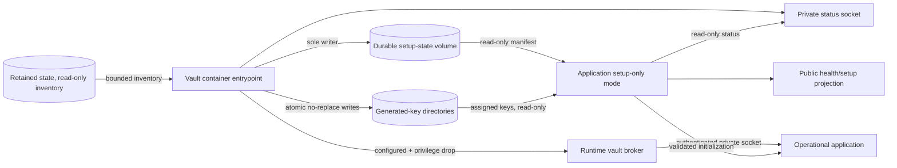

# SecretSauce v2.1 Vault-Owned Provisioning

- **Status:** Approved architecture baseline for milestone planning
- **Governing contract:** `docs/prd/secretsauce-v2.1-prd.md`
- **Supersedes for v2.1:** manual application/vault key provisioning in the v2
  example deployment

## Scope

This record selects the v2.1 coordinator, manifest ownership, deployment
topology, private provisioning-status interface, privilege transition, and
failure behavior. It does not implement the design or change the runtime vault's
credential capabilities.

## Executive Summary

The existing `secretsauce-vault` deployed service owns provisioning through a
startup entrypoint and then transitions into the runtime credential broker. No
third setup service and no initialization CLI are introduced.

The vault entrypoint is the sole writer of a dedicated durable setup-state
volume and the sole generator of SecretSauce-owned application keys. The
application starts concurrently in setup-only mode and reads a bounded private
status operation over a separate Unix-domain socket. The authenticated
credential-broker socket opens only after the manifest commits to `configured`
and the entrypoint drops setup-only privileges. The vault container has no
network attachment in any phase.

## Decision

### Ownership

- The vault provisioning entrypoint owns the installation identifier,
  progressive manifest, per-entry transitions, configured commitment, retry
  state, and sanitized private status.
- A closed registry of key-type adapters inside the vault entrypoint owns key
  format generation, canonical fingerprints, validation, and adoption checks.
- A closed registry of store-specific inventory adapters classifies recognized
  retained key-bound stores as absent/empty, present, or indeterminate.
- Runtime vault and application components never generate or replace application
  keys.

### Deployment topology



Compose starts the vault and application concurrently. The application does not
wait for operational vault readiness merely to expose liveness, readiness,
sanitized setup status, and safe static assets. It defers its database writer,
key-dependent subsystems, and ordinary web, control, OAuth, and MCP behavior
until vault provisioning reports `ready`. The vault service is configured
without a network namespace attachment; both of its interfaces use shared Unix
sockets.

### Access and privilege boundaries

| Phase/identity | Setup state | Generated keys | Retained state | Status socket | Broker socket |
| --- | --- | --- | --- | --- | --- |
| Vault provisioning entrypoint | Read/write | Write only as allowed by the startup matrix | Read-only inventory | Serve bounded read-only status | Closed |
| Vault status-only error identity | Read-only | No setup write access | No setup write access | Serve `configuration_error` | Closed |
| Runtime vault identity | Read-only fields needed by vault | Vault root and caller-verification keys only | Vault store only | Serve `ready` | Open |
| Application setup-only identity | Read-only configured fields | Assigned keys mounted but not loaded before ready | No database writer | Query | No client use |
| Operational application identity | Read-only configured fields | Assigned keys, read-only | Normal least-privilege runtime access | Query | Authenticated client |

The implementation may use process credential changes, a narrow launcher, or an
equivalent irreversible OS boundary. It must prove that the runtime vault cannot
regain setup-only access to application key directories after the broker opens.

### Provisioning-status interface

The status surface is a dedicated Unix-domain socket, not a TCP or public HTTP
endpoint and not an operation on the authenticated credential-broker protocol.
Filesystem ownership and mode authenticate the application identity before
caller HMAC keys exist.

The request has no caller-controlled fields. The closed response contains:

```text
state: preparing | ready | configuration_error
retry_pending: boolean
error_category: bounded sanitized enum | absent
```

The operation cannot start, retry, clear, adopt, or otherwise alter
provisioning. The application treats an absent socket, timeout, malformed
response, or unknown enum as `not_ready`. It maps private status to the PRD's
public setup contract; UX, OAuth, and MCP clients never connect to the vault
directly.

### Lifecycle

1. Both containers start; the application enters setup-only mode.
2. The vault entrypoint loads structural configuration and closed adapter
   registries.
3. It completes all manifest, key, retained-state, storage, and adoption
   preflight checks before a write.
4. If fresh provisioning is permitted, it creates the complete progressive
   manifest before the first key and advances entries durably.
5. Retryable fresh failures retain setup authority, expose `preparing` with
   retry pending, and use bounded backoff.
6. A fatal continuity or validation failure performs no prohibited key/manifest
   write, relinquishes setup authority, and remains in status-only
   `configuration_error` until operator correction and restart.
7. Configured completion commits the aggregate, drops setup-only privileges,
   starts the normal broker, and reports `ready`.
8. The application validates its assigned keys and manifest entries, then
   initializes persistence, audit, broker handshake, jobs, and ordinary
   listeners.

## Security Review

Good: provisioning has one writer and one generator, so there is no distributed
commit protocol or per-service key-generation race. The status socket is
read-only, local, input-free, bounded, and separate from the credential protocol.

Risky: the vault setup phase temporarily has authority over every generated
application key and can inspect whether retained stores contain state. A defect
or compromise in that phase has installation-wide impact.

Change: minimize the setup entrypoint, use closed adapters, perform every
continuity check before writes, prohibit secret-bearing diagnostics, and make
the privilege drop an integration-tested boundary. Give retained-state adapters
read-only access and return only bounded classifications. Deployment tests must
prove the vault has no network attachment, not merely no published port.

Do not change yet: do not add a network setup API, remotely triggered
provisioning, a third service, or a general plugin system. None is required by
the single-instance Compose deployment.

## Architecture Review

Good: using one deployed vault service removes the current startup cycle while
preserving the OS-separated runtime credential boundary.

Risky: the application must have a genuine setup-only composition that does not
take the SQLite writer lock or partially initialize ordinary interfaces before
vault readiness. Treating setup-only mode as scattered route checks would be
fragile.

Change: implement setup-only and operational initialization as explicit
composition-root phases. Use the private status adapter as the single source of
vault provisioning state, then add application-local checks before operational
readiness.

Do not change yet: keep the normal runtime vault protocol, SQLite single-writer
model, and public setup/health schemas. The new status socket is a bootstrap
coordination surface, not a replacement for those established boundaries.

## Overall Opinion

This topology is appropriate for the supported single-instance Compose model.
It resolves coordinator ownership, manifest placement, startup ordering, status
propagation, and failure visibility without adding another deployed service.
Its acceptability depends on validating the setup privilege drop and proving
that no key or manifest write occurs before the complete preflight decision.
