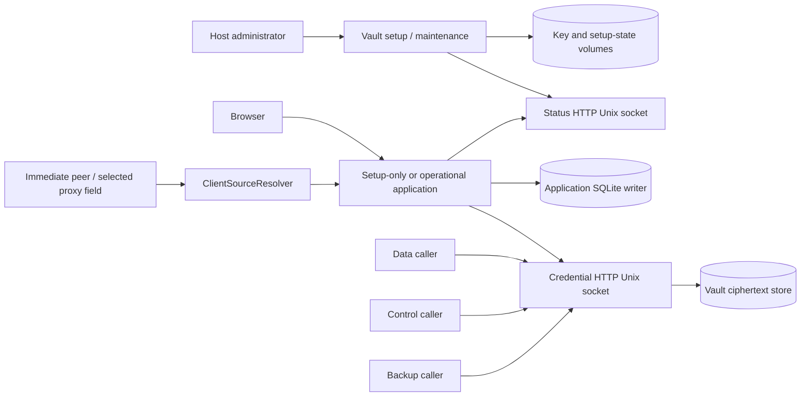

# SecretSauce v2.1 Threat Model

Status: approved implementation baseline. This extends the v2 threat model only
for v2.1 setup, local authentication, browser/session control, private vault
REST, proxy trust, and root maintenance.

## Assets, actors, and assumptions

Assets are the fixed application key set and manifest; envelope roots and
ciphertext; setup/rotation journals; bootstrap, enrollment, password, TOTP,
cookie, CSRF, OAuth, caller-HMAC, capability, and credential material; users,
roles, sessions, grants, source identity, immutable audits, and availability.

Adversaries include an unauthenticated network client, malicious user,
compromised browser, stale or over-scoped admin, compromised data/control/backup
caller, local unprivileged workload, malicious proxy/header sender, and an
operator error that leaves partial key/store state. Host root and kernel
compromise remain outside containment. An infrastructure administrator who can
read the one current bootstrap log line is intentionally trusted for that
single ceremony.

## Trust boundaries and abuse cases

Arrows show permitted communication, not transitive authority. The vault has no
network attachment; both vault HTTP links are filesystem-restricted Unix
sockets. Setup/maintenance authority and credential-listener runtime authority
never coexist.

| Boundary | Allowed path | Denied path and control | Evidence owner |
| --- | --- | --- | --- |
| Host configuration -> vault setup | Fixed registry, valid volumes, optional exact adoption flag | Partial keys, retained/indeterminate state, unknown identity, malformed flag; full preflight before write | 02 |
| Vault setup -> key/manifest stores | Sole entrypoint atomically creates missing pending key and verifies | Replacement, second generator, manifest advance on mismatch; exclusive owner and create-no-replace | 02 |
| Setup-only app -> status socket | Fixed bodyless `GET /v1/status` through validated read-only socket | Query/body/mutation, symlink/rebind, wrong owner/mode, malformed response; fail closed | 01–03 |
| Runtime caller -> credential socket | Valid endpoint, caller HMAC, boot ID, nonce, allowlisted operation | Caller substitution, stale/replay, ambiguous HTTP, cross-operation, forged response; strict adapter and MACs | 01 |
| Data caller -> credential resolve | Fresh request-bound one-use capability after auth/policy/capacity | Unbound read, wrong request/path/service/generation, replay; domain allowlist and capability | 01 |
| Control/backup caller -> vault | Exact write/metadata or authorized bounded transfer | Plaintext read/export by control, resolve by backup, oversized stream; fixed caller matrix | 01 |
| Host root maintenance -> stores | Exact startup args or validated journal, one selected adapter | Remote trigger, concurrent request, SQL/general writer, early root retirement; exclusive maintenance composition | 04 |
| Browser -> enrollment | Restricted same-origin ceremony and final atomic commit | Enumeration, replay, partial user, secret persistence, race; neutral UI, hashes, CAS transaction | 05 |
| Browser/OAuth -> login | Email/password/TOTP or exact OIDC path | Enumeration, timing oracle, brute force, wrong-source identity; uniform work, bounds, shared limiter | 06–07 |
| Proxy field -> source resolver | Mode-specific bounded canonical chain | Spoofed direct field, untrusted trusted-mode peer, ambiguity/oversize; one pre-auth resolver | 07 |
| Session cookie -> application | Current hashed server session, CSRF, eligible user/epoch | Fixation, replay after revoke, cross-site mutation; rotate, same-origin, per-request state check | 06 |
| User/admin -> session/grant control | Own or current exact scoped authority | IDOR, stale list authority, partial service scope, target probing; deciding-transaction predicate | 09 |
| Logout -> persistence/audit/cookie | Atomic revoke+audit then cookie clear | Audit/storage failure presented as success; commit ordering and retry | 06 |
| Suspension/recovery -> identity | Qualifying TOTP failures or authorized reset | Email-keyed counter, OIDC/nonqualifying failure, partial invalidation, remote break glass | 07–08 |

## Privileged operation traces

| Operation | Authentication/host authority -> authorization -> mutation -> invalidation -> audit/recovery |
| --- | --- |
| Fresh provisioning | Vault container identity -> fixed registry and fresh/adoption preflight -> manifest/key adapter writes -> no runtime listener until configured/drop -> sanitized state category; restore matching set on fatal mismatch |
| Root rotation | Exact host args or validated journal -> target/install/request/aggregate preflight -> stage and conditional rewrap -> zero-reference inventory, atomic manifest/receipt, retire old root -> phase/count diagnostics only; resume journal |
| Initial enrollment | Process bootstrap verifier -> zero-user and live ceremony predicate -> user/password/TOTP/role commit -> consume bootstrap/ceremony, no session -> immutable sanitized audit; restart invalidates |
| Local login/suspension | Uniform email/password/TOTP boundary -> current eligibility and limits -> session or qualifying counter transaction -> threshold revokes all human/OAuth/reference state -> safe login/audit outcome |
| Logout | Current session + origin/CSRF -> exact session -> revoke+audit transaction -> cookie clear after commit -> retryable failure retains authority |
| Reactivation/reset | Current admin/host authority -> scope, last-superadmin, target state -> restricted ceremony and credential reset -> epoch/session/grant/token/reference invalidation -> audit and neutral delivery |
| Admin agent revoke | Current session -> current role, target eligibility, complete service scope in transaction -> revoke target(s) -> tokens/references unusable after commit -> sanitized counts/idempotent result |

## Specific threats and mitigations

- **Partial provisioning destroys continuity.** Complete inventory and manifest
  preflight precede writes. Created valid pending keys are reused. Verified or
  configured mismatch never regenerates.
- **Socket permissions are mistaken for authentication.** Credential requests
  use caller-specific HMAC, fixed allowlists, current boot binding, replay
  defense, and authenticated responses. Clients validate non-rebindable
  endpoints before sending secrets.
- **Generic HTTP normalization creates signature ambiguity.** The raw-message
  guard rejects duplicate security fields, absolute/authority/asterisk targets,
  conflicting framing, upgrades, invalid encoding, and over-bounds before the
  canonical signature input or domain dispatch.
- **A vault restart accepts old authority.** A fresh boot UUID invalidates old
  requests, nonces, capabilities, transfers, and responses. Durable work needs a
  fresh handshake and authorization. Root maintenance uses its separate durable
  host request UUID before the listener exists.
- **Root rotation strands ciphertext.** Old root remains through conditional
  rewrap and authoritative zero-reference inventory. Only atomic
  manifest/receipt commit permits retirement; interruption resumes.
- **Initial enrollment creates a ghost account.** Provisional state is not a
  user. All identity/authenticator/role/audit state commits once after final
  proof and zero-user recheck.
- **Authentication reveals account or suspension state.** All local failures
  share response, focus behavior, rate response, and measured work buckets.
  Durable suspension counts key a verified immutable user UUID.
- **Forwarding input creates limiter identities.** One resolver canonicalizes
  peer/chain input before every listener's auth and limiter work; direct mode
  ignores headers and trusted mode requires an allowed immediate peer.
- **Logout UI lies after a failed commit.** Cookie clearing and success
  navigation happen only after revoke+audit commit. Failure stays authenticated.
- **Stale admin scope revokes a hidden grant.** Role, target eligibility, and
  complete current service scope are deciding transaction predicates; an
  earlier projection supplies no authority.
- **Metadata becomes XSS or personal-data leakage.** Raw user agent, full IP,
  and forwarding chain are discarded. Closed derived labels and coarse network
  are escaped and bounded.
- **Diagnostics exfiltrate secrets.** Ordinary logs contain only request UUID,
  caller category, route template, status, duration class, and sanitized
  category. Raw headers, bodies, cookies, bearer values, keys, internal paths,
  and downstream responses are prohibited.

## Revocation races

Authentication reads durable current state before dispatch. A request already
dispatched at revocation commit may finish; the first request authenticated
after commit fails. Bulk mutations include the initiating session when in
scope. A stale list, cached grant, or prior capability cannot authorize a later
mutation or resolution. Tests place barriers immediately before deciding reads,
commit, and post-commit authentication.

## Residual risk

An authorized compromised caller can exercise its current fixed operations. An
operator with host-root authority can read or replace local state. Timing
comparability reduces practical enumeration but cannot make distributed request
latency identical. `SOURCE_MODE=always` intentionally accepts spoofability if
network isolation/header sanitization is wrong. Exact/pattern response scanning
does not prevent transformed credential reflection.

No artifact claims stronger containment.
