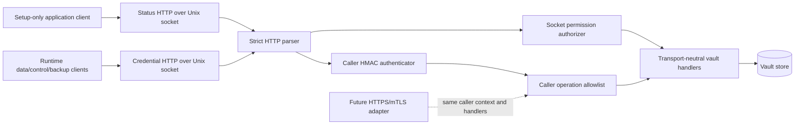

# SecretSauce v2.1 Private Vault REST API

- **Status:** Approved architecture baseline for milestone planning
- **Governing requirements:** `VAULTAPI-001` through `VAULTAPI-008`
- **Current transport:** HTTP/1.1 over Unix-domain sockets
- **Deferred transport:** HTTPS with mutually authenticated service identities
- **Supersedes for v2.1:** the custom binary framing decision in v2 ADR-001

## Scope

This record selects the application protocol and transport seam for the private
vault status and credential interfaces. It does not add a TCP listener, remote
vault deployment, certificate lifecycle, or network API in v2.1.

## Executive Summary

The v2.1 vault uses a versioned REST-style HTTP API instead of custom binary
framing. Two HTTP/1.1 servers listen on separate filesystem-restricted
Unix-domain sockets:

- a pre-key, read-only provisioning-status API; and
- an authenticated credential API that opens only after configured setup and
  privilege drop.

Unix-socket permissions reduce reachability but do not contain a compromised
authorized caller. Runtime containment continues to come from caller-specific
authentication, fixed operation allowlists, one-use capabilities, current
authorization, and least-privilege key distribution.

The vault also proves itself to clients. Both socket parents are vault-owned,
non-symlinked, and non-rebindable by clients; clients receive the socket volume
read-only and validate endpoint metadata before connection. Credential responses
carry a request-correlated HMAC authenticator. This preserves mutual trust
without adding HTTPS or a network attachment in v2.1.

HTTP parsing and transport authentication terminate before transport-neutral
vault domain handlers. A later version can add an HTTPS/mTLS adapter that
produces the same authenticated caller context and invokes the same handlers.
No dormant network transport ships in v2.1.

## Decision

### API contract

One canonical OpenAPI 3.1 document defines both private interfaces. It is the
contract for server routing, first-party clients, schemas, media types, status
codes, error categories, bounds, and tests.

The API uses:

- versioned resource paths under `/v1`;
- standard HTTP methods and status semantics;
- closed JSON schemas for status, metadata, and control envelopes;
- explicit bounded media types for secret-bearing or streaming bodies;
- request UUIDs for correlation/idempotency where applicable; and
- bounded sanitized error documents.

The API has no cookies, browser sessions, CORS behavior, redirects, proxy
discovery, HTML, form encoding, or general-purpose forwarding.

### Transport adapters



The Unix adapter owns socket paths, filesystem permissions, HTTP parsing,
deadlines, connection limits, and request authentication. Domain handlers
receive only:

```text
AuthenticatedCallerContext
ValidatedVaultOperation
RequestMetadata
```

They do not receive socket handles, peer paths, HTTP request/response objects,
TLS state, or transport-specific headers.

Both Unix-socket parents must be owned by the vault identity, contain no
symlinked path component, and deny write, bind, unlink, and rename authority to
application, data, control, backup, and unrelated workload identities. Client
containers mount the socket volume read-only. Before sending a request, a client
validates the expected parent and endpoint type, owner, and mode. An absent,
replaced, writable, wrongly owned, or non-socket endpoint fails closed.

### Caller authentication

Filesystem permissions are defense in depth for the credential API. Each
runtime request also carries a caller-specific HMAC authentication envelope.
The signed canonical input binds:

- stable logical vault audience independent of socket path or hostname;
- protocol and API version;
- claimed caller identity;
- uppercase HTTP method;
- canonical origin-form request target;
- selected representation headers;
- digest of the exact raw request body;
- request UUID;
- bounded timestamp; and
- random nonce.

The server rejects non-canonical security encodings, duplicate security headers,
unknown callers, bad MACs, stale timestamps, and replayed nonces before
authorization or store access. It then maps the authenticated caller to a fixed
operation allowlist.

Each response after successful caller authentication has a canonical HMAC
authenticator bound to:

- stable logical vault audience and API version;
- authenticated caller;
- current vault boot identifier;
- request UUID;
- HTTP status;
- selected response representation headers; and
- digest of the exact raw response body.

The client verifies that binding before parsing or using the response. The
client treats a connection close or unsigned pre-authentication response only as
a generic unavailable/authentication failure, never as a vault-domain result.
The pre-key status endpoint cannot use a caller key and instead relies on its
non-rebindable filesystem endpoint plus its closed, non-secret response.

Each credential-API process start creates a fresh unpredictable non-secret boot
identifier returned through the authenticated readiness handshake. Requests and
operation-bound capabilities bind it. The fixed, store-free readiness handshake
is the sole boot-unbound credential request; its authenticated response binds the
request UUID and returns the current boot identifier. Restarting only the vault
invalidates all prior outstanding requests, nonces, capabilities, and in-memory
transfers. Durable journaled work may resume only after a new handshake and
fresh authorization.

This preserves the existing caller separation:

| Caller | Permitted capability |
| --- | --- |
| Data plane | Operation-bound, one-use credential resolution only |
| Control plane | Credential create/replace/delete and non-secret metadata |
| Backup coordinator | Explicitly authorized bounded export/import/snapshot operations |
| Local key administration | Host-authorized lifecycle operations only |

A compromised caller retains the risk inherent in its permitted operations.
Neither Unix sockets nor a future private network changes that. The server-side
allowlist and capability validation prevent it from acquiring another caller's
authority.

### Status API

Before caller keys exist, the status listener relies on filesystem ownership and
mode to authorize the setup-only application identity. It exposes one fixed
bodyless, queryless, parameterless read resource. Its response is bounded to:

```text
state: preparing | ready | configuration_error
retry_pending: boolean
error_category: bounded sanitized enum | absent
```

It cannot start, retry, adopt, clear, or otherwise mutate provisioning and never
returns key, path, store, user, or record details.

### HTTP hardening

Before domain dispatch, the Unix HTTP adapters reject:

- unknown methods/routes and unsupported media types;
- absolute-form or otherwise non-canonical request targets;
- duplicate authentication/signature headers;
- conflicting or ambiguous message framing;
- unsupported upgrades;
- oversized request lines, headers, bodies, or streams;
- invalid text encoding and unknown schema fields; and
- timeouts, excess concurrency, and incomplete bodies.

Access logs and diagnostics contain only request UUID, authenticated caller
category, route template, status, duration class, and sanitized error category.
They never contain opaque authentication values, raw headers, cookies,
credentials, or request/response bodies.

### Future HTTPS seam

HTTPS is deliberately absent in v2.1. A future transport may be added only
through a new adapter that:

- serves the same OpenAPI resources and media types;
- maps a validated mTLS service identity to the same
  `AuthenticatedCallerContext`;
- provides mutually authenticated endpoint identity, confidentiality, and
  channel integrity while retaining request/boot correlation;
- preserves operation allowlists, capabilities, request bounds, replay and
  idempotency behavior, errors, and secret-free logging;
- defines certificate issuance, rotation, revocation, trust anchors, service
  discovery, network isolation, timeouts, and remote failure behavior; and
- passes the same transport-neutral handler contract suite.

No v2.1 configuration key, dormant listener, or untested code path enables TCP
or HTTPS.

## What Is Good

Good: standard HTTP/OpenAPI tooling removes a bespoke framing parser and makes
client/server contract drift easier to detect.

Good: keeping Unix sockets for v2.1 retains same-host reachability control and
avoids premature certificate and remote-availability complexity.

Good: caller identity and authorization are application-layer contracts, so a
future HTTPS transport does not require rewriting vault behavior.

## What Is Bad Or Risky

Risky: HTTP has more generic parsing behaviors than the fixed frame it replaces.
Ambiguous framing, duplicate headers, upgrades, and request-target forms must be
explicitly rejected because no reverse proxy normalizes this private traffic.

Risky: OpenAPI can describe a safe contract without enforcing it. The server and
all clients must use runtime validation and cross-implementation contract tests.

Risky: calling the interface “private” may tempt implementers to rely only on
socket permissions. Runtime caller authentication and operation authorization
remain mandatory.

Risky: caller authentication alone proves requests in only one direction.
Endpoint ownership, a read-only client mount, and response authentication are
required so a client does not send a secret to or accept a result from an
impostor listener.

## What Should Change

Change: implement one strict private HTTP boundary shared by status and
credential listeners, with different route allowlists and authentication
policies. Keep all vault operations behind transport-neutral handlers.

Change: replace custom frame tests with HTTP parser, OpenAPI conformance, HMAC
request/response binding, endpoint replacement, vault-restart invalidation,
replay, caller-substitution, cross-caller authorization, and secret-free
diagnostics tests.

## What I Would Not Change Yet

Do not add HTTPS, mTLS certificates, a Docker network, a remote-vault setting, or
transport negotiation in v2.1. Designing the seam is sufficient; shipping an
unused network transport would add attack surface and an unvalidated support
promise.

Do not remove caller-specific HMAC authentication merely because Unix socket
permissions exist. Socket access and request authority protect different
boundaries.

Do not add HTTPS merely to authenticate the same-host v2.1 endpoint. The
vault-owned non-rebindable socket path and authenticated response provide the
required local contract without introducing certificate lifecycle or a network
attachment.

## Overall Opinion

REST over Unix sockets is the better v2.1 tradeoff. It improves maintainability,
contract tooling, and future transport flexibility without weakening the
same-host deployment boundary. Its security depends on keeping the HTTP surface
strict and preserving server-side caller/capability enforcement rather than
crediting the socket transport with protections it does not provide.
