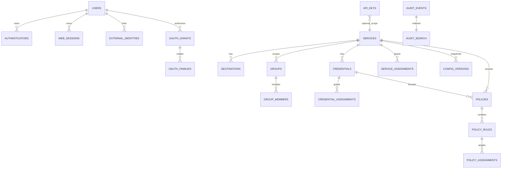

# Normalized Data Model

## Conventions

- Primary keys are UUIDv7 text in canonical lowercase form. IDs never change.
- Timestamps are UTC integer milliseconds. Emails use Unicode normalization,
  whitespace trimming, and case-folding into a separately unique normalized
  column.
- Mutable aggregate roots have positive integer `version`, `created_at`, and
  `updated_at`. `UPDATE ... WHERE id=? AND version=?` increments the version;
  zero affected rows is a stale-write conflict.
- Foreign keys are explicit. `CASCADE` is used only for owned operational state;
  historical audit has no principal foreign key. Soft lifecycle state is explicit,
  not inferred from nullable fields.
- Secret columns are forbidden outside their designated hash/envelope tables.

## Entity relationships

## Tables and deletion behavior

| Aggregate/table | Key fields and constraints | Delete/retention |
| --- | --- | --- |
| `users` | normalized email unique; role/status/provider; security epoch; password-policy version; activity timestamps; version | Permanent delete only from `deactivated`; cascades owned operational rows; no tombstone |
| `authenticators` | user FK; kind; password hash or encrypted TOTP envelope; temporary/forced state; accepted TOTP step | Cascade user; secret fields cleared on deactivation/reset |
| `external_identities` | unique provider + issuer + subject; user FK; allowlisted claim source metadata | Cascade user |
| `web_sessions` | keyed token hash unique; user FK; epochs; CSRF hash; expiries; step-up metadata | Cascade/revoke; expiry job |
| `oauth_clients` | client ID; redirect URIs; metadata status/cache | Retain while grants reference; archive |
| `oauth_grants` / `oauth_families` | user/client/resource; scopes; token hashes; epochs; expiry/replay/revocation | Cascade user; retain revoked metadata 400 days without tokens |
| `services` | slug unique; lifecycle; publication generation; version | Archive first; permanent delete cascades live config/bindings and requests vault deletes; audits remain |
| `destinations` | service FK; canonical base URL components; TLS; version | Cascade service; change increments publication generation |
| `credentials` | service FK; placement metadata; status; vault locator/generation; last-four; version | Cascade service; delete vault value and bindings; config history has no value/hint |
| `groups` / `group_members` | service FK; name unique within service; member user must have role `user`; version | Cascade service/group/user |
| assignment tables | selector kind constrained; exactly one group/user target or explicit `all`; same-service triggers/checks | Cascade referenced live entities; excluded from backup restore |
| `service_admins` | service/admin UUID unique; target role must be `admin` | Cascade live entity; restore removes |
| `policies` / `policy_rules` | exactly one service or credential boundary; mode/effect/priority/match fields; version | Cascade boundary; immutable history redacts principals/secrets |
| `api_keys` | keyed verifier hash; static role; service scope iff role=`service`; immutable authority/expiry except shortening; status | Revoke retains metadata 400 days; restore revokes all |
| `config_versions` | service, sequence, canonical redacted JSON, digest, actor snapshot | 100/service and 400-day dual cap; current retained |
| `audit_events` | event ID/time/domain/action/result; actor/target/service snapshots; sanitized changes; correlation | No user FK; immutable; default 400-day retention |
| `audit_search` | contentless FTS5 row keyed by audit event | Insert/delete transactionally with event |
| `activity_hourly/daily` | bounded dimensions and counters | Hourly rolls after 32 days; daily follows audit retention |
| `settings` | typed key; validated JSON value; version | Instance-local; excluded from portable backup |
| `schema_migrations` | version, name, checksum, applied time/product version | Never delete or rewrite |
| `jobs` / `job_leases` | kind, cursor, state, attempt, bounded error code | Completed metadata 30 days; one instance lease |
| `restore_journal` / `remediation_tasks` | phase, snapshot ID, safe counts/status | Journal cleared after health gate; tasks persist until audited resolution |
| `vault_authorizations` | one-use operation digest, browser actor, expiry, consumed time | Maximum 15 minutes; no secret/passphrase |

Database checks plus transaction-level domain validation enforce cross-table role
and same-service invariants that SQLite checks cannot express safely. Repository
methods never accept a caller-provided actor role as authority; middleware supplies
the authenticated context.

## Indexes and query bounds

Required indexes include:

- `users(normalized_email)` unique and `(status,role)`.
- External identity unique `(provider_id,issuer,subject)`.
- Sessions/grants by token hash, `(user_id,status,expires_at)`, and expiry.
- Services unique slug; all child tables start indexes with `service_id`.
- Group membership unique `(group_id,user_id)`.
- Each assignment has a unique normalized `(parent_id,selector_kind,target_id)`.
- Rules `(policy_id,enabled,priority DESC)` and version history
  `(service_id,sequence DESC)`.
- API key identifier unique and `(status,expires_at)`.
- Audits `(occurred_at,event_id)`, `(service_id,occurred_at,event_id)`,
  `(actor_id_snapshot,occurred_at,event_id)`, and `(result,occurred_at,event_id)`.
- Jobs `(state,next_run_at)`, retention tables by expiry/time.

All lists use keyset cursors with a deterministic UUID tie-breaker. Offset
pagination is prohibited for retained/event data. Counts and reports have explicit
time windows and result caps.

## Schema and transaction ownership

Migration `0001` creates schema metadata and the persistence/audit foundation
consumed by Milestone 01. A migration runs once inside `BEGIN EXCLUSIVE`, checks
its embedded checksum, updates `schema_migrations`, and commits before listeners
start. Unknown future versions, a changed historical checksum, failed integrity
check, or missing required pragma makes readiness fail.

Only the persistence worker may open the writable database. A command owns at most
one top-level transaction and returns after commit. Mutations, invalidation
generations, job enqueue, activity update when applicable, audit event, and audit
FTS insert share that transaction.

## Required lifecycle walkthroughs

- **User deletion:** verify deactivated and not protected superadmin; delete
  operational rows and memberships; invalidate user generation; keep denormalized
  audits readable with no live FK.
- **API-key revocation:** atomically set revoked state/version and audit; verifier
  fails immediately; raw key was never stored.
- **Global security event:** increment global epoch, revoke sessions/grants, clear
  references through runtime invalidation, mutate authenticator state, and audit in
  one transaction.
- **Service publication:** validate full draft, create redacted config version,
  increment publication generation, publish live rows, invalidate affected
  references, and audit atomically.
- **Restore:** stage and validate outside live tables; enter maintenance; create
  encrypted recovery snapshot; transactionally replace portable domains, remove
  bindings, disable/unassign policies, revoke API keys/sessions/grants, increment
  global epoch, create remediation tasks and audit; health-gate before cleanup.
