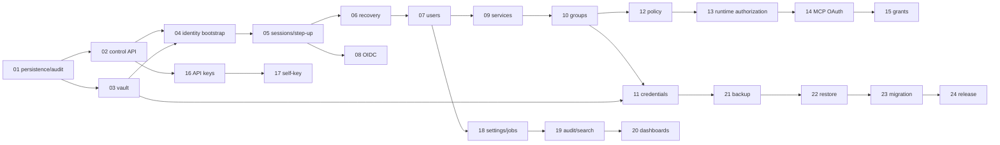

# Dependencies and Delivery Sequencing

## Approved technology selections

Dependencies are approved for later milestone addition, not added by Milestone 00.
Versions must be pinned through the existing lockfile and reviewed when introduced.

| Purpose | Selection | Justification and maintenance boundary |
| --- | --- | --- |
| SQLite | `better-sqlite3` | Mature Node 22 support, explicit synchronous transaction ownership in a worker, SQLite backup/FTS5 support; native-binary updates require CI coverage |
| Runtime/API schemas | Existing Zod | One runtime/OpenAPI contract source; no second validator |
| Management HTTP | Fastify 5 plus official security/cookie/form plugins only as needed | Maintained, bounded plugin surface, schema/hooks fit explicit middleware; no framework authorization |
| OpenAPI | `@asteasolutions/zod-to-openapi` | Generates 3.1 from Zod route registry; CI drift test |
| SPA | React 19, Vite, React Router | PRD-recommended responsive client; browser has no secret state authority |
| Password/KDF | `argon2` | Bindings to the reference Argon2 implementation, tested on Node 22 with PHC password strings; native build/prebuild provenance is covered by CI and release review |
| Encryption/signatures | Node `crypto` and existing `jose` | AES-256-GCM, HMAC, random bytes, OIDC/JWS without another cryptographic toolkit |
| UUID | `uuid` package UUIDv7 | RFC 9562 IDs on full Node 22 range; parsing stays in Zod |
| Vault framing | Internal fixed binary header + closed Zod JSON payload | HMAC authenticates raw bytes, avoiding parser canonicalization ambiguity and another protocol dependency |
| Archive | `tar-stream` + `zlib` | Streaming entry-by-entry validation; never shell out or unpack blindly |
| Browser testing | Playwright | Real enrollment, security-header, responsive, and secret-free UI checks |
| Unit/integration | Existing Vitest | Focused and unchanged full-suite gates |

No ORM, queue, general policy language, service-specific SDK, component-design
system, or general vault library is approved. Native dependencies need Linux
x64/arm64 build verification and documented source-build fallback. Cryptographic
parameters and envelope formats are versioned; algorithm changes require an ADR
and migration, not silent reinterpretation.

## Composition roots and harnesses

- `Application` owns configuration, lifecycle, persistence worker, identity and
  authorization services, invalidation bus, jobs, audits, vault client, and the
  two HTTP listener applications.
- `VaultBrokerApplication` is a separate executable and OS identity.
- `CliApplication` constructs only local host-authority commands; it cannot start
  public listeners.
- Unit tests use fake clock/randomness and pure policy/lifecycle matrices.
- Repository tests use a real temporary SQLite database with WAL, actual
  migrations/FTS/transactions, injected write/busy/corruption failures, and one
  persistence owner.
- Vault integration starts the real broker over a temporary Unix socket with
  distinct caller keys and corrupted/replayed frames.
- HTTP integration binds both real listeners and verifies separation. Browser E2E
  uses HTTPS origins under `example.org` mappings. Existing self-signed downstream
  transport coverage remains whenever transport changes.
- Archive fixtures cover valid, partial, malformed, traversal, excessive,
  credential-less, encrypted, and prior supported schemas.

## Dependency-ordered milestone constraints

Milestone 01 begins with schema `0001`, the migration runner, persistence worker,
unit-of-work API, immutable control audit plus transactional FTS, activity bucket
skeleton, instance lock, readiness check, and real SQLite failure harness. It does
not add management endpoints.

Milestone 02 adds the separate control listener, route registry, generated OpenAPI,
common wire contracts, browser/API-key authentication interfaces (without full
identity behavior), centralized permission table, ETag/idempotency infrastructure,
and security headers. Later domains add routes only through this registry.

Milestone 03 adds the broker executable, OS/caller capability protocol, envelope
store, root-key CLI, and test harness before any credential workflow. Milestones
04–08 build identity in lifecycle order. Milestones 09–13 build configuration from
parent service through authorization and only then replace YAML runtime authority.
Milestone 14 wires multi-user OAuth after dynamic authorization is real.

Backup precedes restore; restore precedes v1 migration so both reuse staging,
validation, vault import, and recovery. Release hardening is the only milestone
that may declare v2 ready and must prove both Codex and ChatGPT clients.

Every milestone must plan minimal independently useful slices, add positive and
negative tests for each input/state transition, run focused tests then
`npm run build` and unchanged `npm test`, and commit one concise slice at a time.

## Selection references

- [better-sqlite3 project and worker/WAL guidance](https://github.com/WiseLibs/better-sqlite3)
- [Fastify v5 Node support and LTS policy](https://fastify.dev/docs/latest/Reference/LTS/)
- [node-argon2 Node and platform support](https://github.com/ranisalt/node-argon2)
- [uuid RFC 9562 implementation](https://github.com/uuidjs/uuid)
- [Zod to OpenAPI 3.1 generator](https://github.com/asteasolutions/zod-to-openapi)
- [Vite supported-version policy](https://github.com/vitejs/vite/blob/main/docs/releases.md)
- [tar-stream streaming parser/generator](https://github.com/mafintosh/tar-stream)
- [RFC 9106 Argon2](https://www.rfc-editor.org/rfc/rfc9106)
- [RFC 9562 UUIDs](https://www.rfc-editor.org/rfc/rfc9562)
