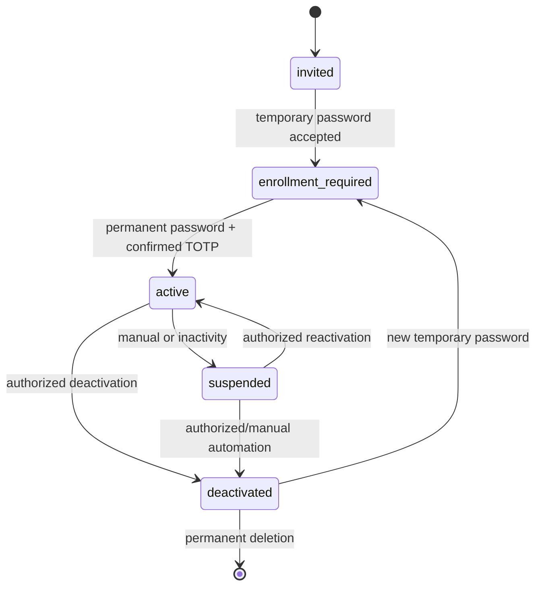
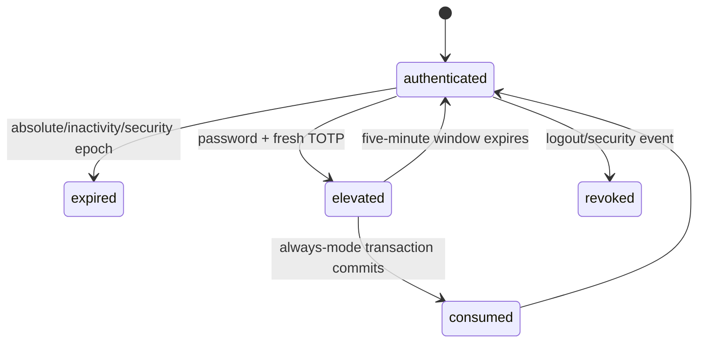
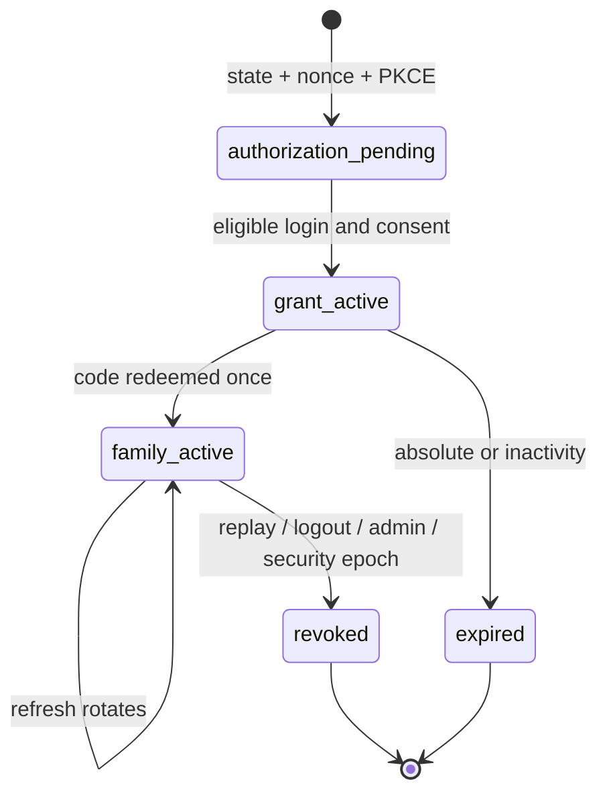

# Identity, Sessions, OAuth, and Invalidation

## Local identity lifecycle

The last active superadmin check is a transaction predicate on every manual,
automatic, restore, migration, and API path. Deactivation deletes authenticators,
sessions, grants, and references. Permanent deletion has no tombstone and cascades
operational identity rows; immutable denormalized audit snapshots remain.

Enrollment and recovery sessions are opaque, server-side, narrowly scoped, and
cannot authorize ordinary control or MCP operations. TOTP acceptance atomically
records `(user_id,time_step)` so replay loses even under concurrency.

## Browser session and step-up

The browser stores only a random session cookie (`Secure`, `HttpOnly`, host-scoped,
appropriate `SameSite`). The server stores its keyed hash, CSRF binding, epochs,
created/last-seen/absolute expiry, and step-up state. In `always` mode the
single-use proof binds the method, route, target IDs, expected versions,
idempotency key, and normalized body digest.

## OAuth state

Authorization codes, access tokens, and refresh tokens are random and stored only
as domain-separated keyed hashes. Code redemption validates exact redirect URI,
client, MCP resource, PKCE S256, one-use state, expiry, and eligible `user` role.
Every access request validates grant/family state, audience/scope, user and global
epochs, account status/role, and then current service authorization. Admins,
superadmins, ineligible users, and nonexistent accounts have uniform public
failures with comparable password-verification work.

## Invalidation matrix

| Event | Sessions | OAuth grants/families | Runtime references | Other |
| --- | --- | --- | --- | --- |
| Password/TOTP/email change or reset | All user | All user | All user | Increment user security epoch |
| Role/status change | All user | All user | All user | Recheck last-superadmin |
| Assignment removal | Preserve | Preserve | Affected service | Dynamic denial immediately |
| Service disable/archive | Preserve | Preserve | Service | Publication generation increments |
| Destination change | Preserve | Preserve | Changed destination | Publication generation increments |
| Credential replace/delete | Preserve | Preserve | Credential | Vault generation increments |
| Policy publish | Preserve | Preserve | Affected boundary | Evaluate new policy immediately |
| Global password/TOTP event | All | All | All | Increment global epoch |
| Restore | All | All | All | Revoke all API keys; global epoch |
| Restart | Durable sessions validated | Durable grants validated | All lost | Expected ephemeral behavior |

Invalidation events commit with their mutation and audit. Runtime caches carry the
relevant generation and have a maximum 15-second lifetime, but durable generation
mismatch is checked before reference resolution so security changes are immediate.

## OIDC normalization

The adapter returns provider ID, exact issuer, stable subject, authentication time,
verified MFA boolean and evidence, and allowlisted profile claims. It validates
discovery without redirects to special-use addresses, pins validated DNS for the
connection, and bounds time/size/concurrency/cache. Account linking requires an
invitation or explicit superadmin action and exact `(issuer,subject)`; verified
email alone never links. Provider profile claims cannot mutate roles,
assignments, groups, or local security state.
