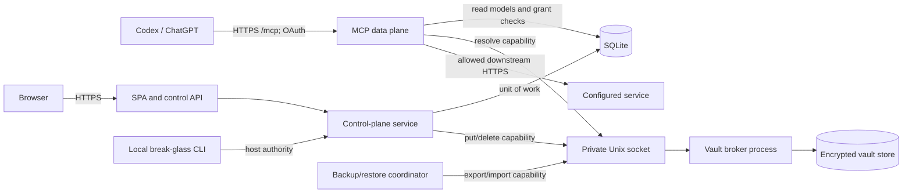
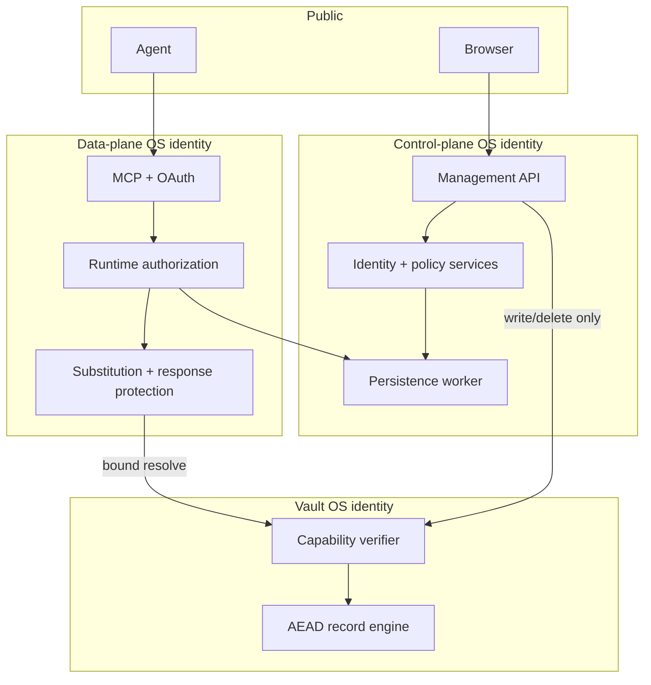
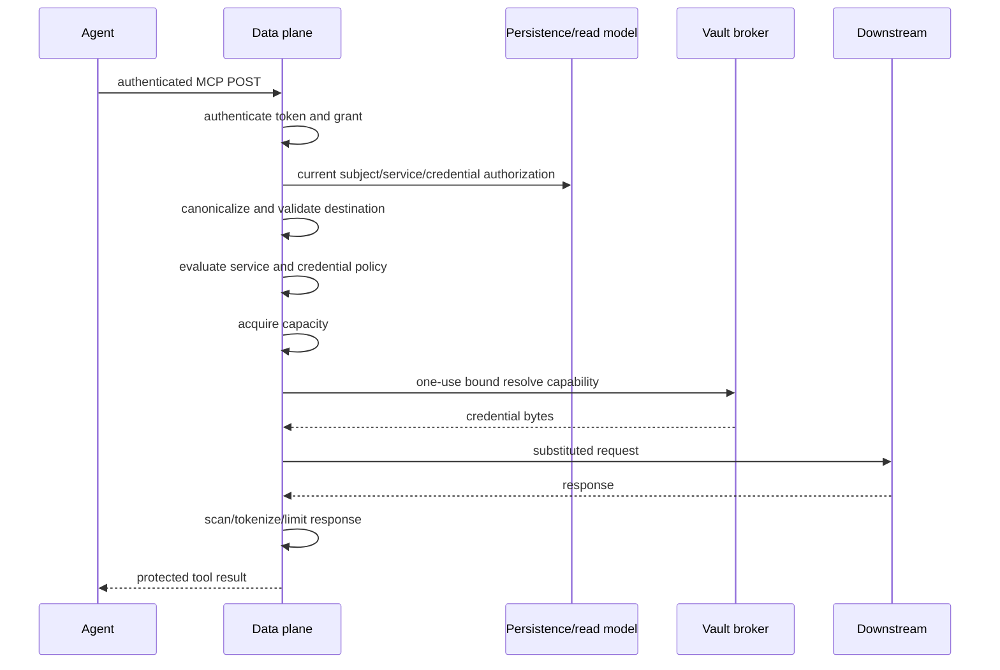

# System Architecture

## Components and deployment



Deployment runs one stack with separate OS identities:

- `secretsauce-data`: owns the MCP/OAuth listener and runtime capability state.
- `secretsauce-control`: owns the web listener, persistence worker, and jobs.
- `secretsauce-vault`: owns the private socket, vault store, and vault root keys.
- `secretsauce-backup`: an on-demand identity allowed only during authorized
  backup/restore.

The data and control listeners may bind loopback behind separate reverse proxies,
but have distinct configured public origins. OAuth issuer and MCP resource are
origins; ChatGPT's Server URL is `https://mcp.example.org/mcp`. The vault has no
TCP listener. Readiness is false unless schema, database, vault, audit, keys, jobs,
and active configuration are usable. Health responses expose only stable check
names and status.

## Trust boundaries and data flow



| Secret class | Create/write | Resolve/read | Export | Delete |
| --- | --- | --- | --- | --- |
| Downstream credential | Control via `put` | Data via bound `resolve` | Backup via stepped-up `export` | Control |
| TOTP seed | Identity enrollment | Identity verification only | Never | Identity reset/deletion |
| Password/API-key verifier | Identity/control | Verification function only | Never | Lifecycle/revocation |
| OAuth/session/reference token | Issuer creates hash | Validator compares hash/state | Never | Revoke/expire |
| Instance root keys | Operator | Owning process only | Operator-managed | Operator after verified rotation |
| Backup passphrase | Browser to backup stream | In-memory KDF only | Never | Zeroized after operation |

No browser, management read endpoint, audit, log, health response, or configuration
history can retrieve these values.

## Explicit component interfaces

All interfaces use closed, versioned, runtime-validated messages with byte and
collection limits.

```text
Identity.authenticate(request) -> AuthenticationContext
Identity.requireStepUp(context, transactionDigest) -> StepUpProof
Authorizer.decide(context, action, resourceSnapshot) -> Decision + reasons
Policy.evaluate(context, canonicalRequest, boundaries) -> DecisionTrace
Persistence.withTransaction(command) -> committed result + audit event
Vault.put(writeCapability, credentialId, secretBytes) -> metadata
Vault.resolve(resolveCapability, operationDigest) -> one-use secret bytes
Vault.export(exportCapability, archiveKey) -> encrypted stream
Invalidator.publish(committedEvent) -> affected subject/service generations
```

`AuthenticationContext` contains principal type/UUID, authentication method,
account/API role, immutable service scope, security/global epochs, session/grant
IDs, assurance time, and correlation ID. It never contains a bearer value.

The data plane asks the control-plane read model for a revisioned authorization
snapshot. It still validates user/grant/security epochs and current assignments on
every request. Invalidation increments durable subject/service/credential/global
generations transactionally; in-memory caches and references include generations
and fail closed on mismatch. Restore increments the global generation.

## Runtime request order



Any failure before the vault call produces no credential resolution and no
downstream I/O. Every path produces sanitized correlation and audit metadata.

## Lifecycle and failure ownership

The composition root starts in order: configuration and key validation, exclusive
instance lock, migration validation/application, persistence worker, audit/FTS
reconciliation, vault handshake, jobs, control listener, then data listener.
Shutdown reverses the order and is idempotent. Partial startup closes already
started resources. The application rejects privileged traffic during migration,
restore, vault lock, audit degradation, or configuration activation failure.

SQLite owns authoritative identity/configuration/audit/job state. Runtime
references remain memory-resident and restart-ephemeral. The vault store is
authoritative only for credential ciphertext and generation metadata; SQLite
never contains downstream plaintext.

## Existing gateway boundary

Milestones preserve the five generic MCP tools and existing destination,
substitution, response-protection, stateless transport, and downstream TLS
semantics. V2 replaces YAML as runtime configuration authority after migration and
injects persisted identity/authorization snapshots behind current domain
interfaces. No service-specific tool or profile pack is introduced.
